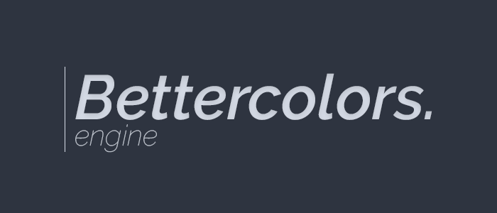

<h3 align="center">
  
</h3>

    
    
    

A hacking engine that does the annoying part for you. Designed to work with any version of forge.
This engine is the one used by the mod [Bettercolors](https://github.com/N3ROO/Bettercolors).

## Support

- Forge 1.16.1: :heavy_check_mark:
- Forge 1.15.2: :x: *(not tested yet)*
- Forge 1.14.4: :x: *(not tested yet)*
- Forge 1.13.2: :x: *(not tested yet)*
- Forge 1.12.2: :x: *(not tested yet)*
- Forge 1.8.9: *in progress*

## Why?

With that engine, the only thing that you need to do is to implement your modules (aimbot, autoclick, whatever). Then, the rest
is handled by the engine (window, parameters, file saving, version checking, and so on).

Here is what the automatically generated window looks like:

    

## How to use it

- Download the files (`dev.nero.bettercolors.engine`) and paste them in your project *(a maven package will be published later on)*
- Create the main class to register your mod with forge
- Start the engine by giving some information about your mod and the modules that you created
- Write some modules by extending the Module class
- That's it. The engine is designed to work for any forge version from 1.8.9 to 1.16.2

**There are some examples on github, check the branches `example-1.8.9` or `example-1.16.2`.**

*You also can check [Bettercolors](https://github.com/N3ROO/Bettercolors) 7.x.x when it will be released, it will use the engine.*

## Documentation

*Coming for the first stable release*.
Check [github projects](https://github.com/N3ROO/BettercolorsEngine/projects) to see the roadmap.

## Credits & Acknowledgements

- [@N3ROO](https://github.com/N3ROO)  - *Main developer*
- [@shorebre4k](https://github.com/shorebre4k) - *Added option to change the GUI's toggle key (issue #15 & pull request #35)*
